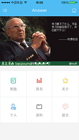
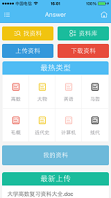
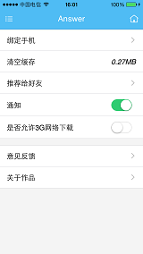

title: 作品展示
date: 2015-11-21 16:51:39 
---

## Otaku! ##

### 一款基于HTML5跨平台技术与PHP作为后台的开源项目 ###
#### 跨平台手机前端APP ####
基于cordova+ionic+angularjs
github:[https://github.com/moonrailgun/otaku-for-cordova](https://github.com/moonrailgun/otaku-for-cordova)

#### 管理后台 ####
基于OSAdmin架构实现
github:[https://github.com/moonrailgun/otaku-website](https://github.com/moonrailgun/otaku-website)

### [了解更多](./Otaku/) ###

## Answer ##

### 预览 ###
   

### 关键技术 ###
- HTML5
- CSS3
- APICloud

### [了解更多](./Answer/) ###

## WebCollector ##

### WebCollector是一个基于NodeJS的高性能网站抓取工具 ###

### [了解更多](./WebCollector/) ###