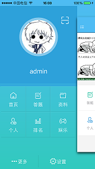

title: 作品展示
date: 2018-07-03 14:41:32
---

## devbox开发者工具箱 ##
### 一款专为开发者准备的前端工具箱 ###
基于electron+vue
github:[https://github.com/moonrailgun/devbox](https://github.com/moonrailgun/devbox)

## Yoa ##
### 前端mvvm框架 ###
学习用, 功能简单。只有模板中变量修改更新页面的功能
github:[https://github.com/yoajs/yoa](https://github.com/yoajs/yoa)

## Otaku! ##

### 一款基于HTML5跨平台技术与PHP作为后台的开源项目 ###
#### 跨平台手机前端APP ####
基于cordova+ionic+angularjs
github:[https://github.com/moonrailgun/otaku-for-cordova](https://github.com/moonrailgun/otaku-for-cordova)

#### 管理后台 ####
基于OSAdmin架构实现
github:[https://github.com/moonrailgun/otaku-website](https://github.com/moonrailgun/otaku-website)

### [了解更多](./Otaku/) ###

## Answer ##

### 预览 ###
   

### 关键技术 ###
- HTML5
- CSS3
- APICloud

### [了解更多](./Answer/) ###

## WebCollector ##

### WebCollector是一个基于NodeJS的高性能网站抓取工具 ###

### [了解更多](./WebCollector/) ###
